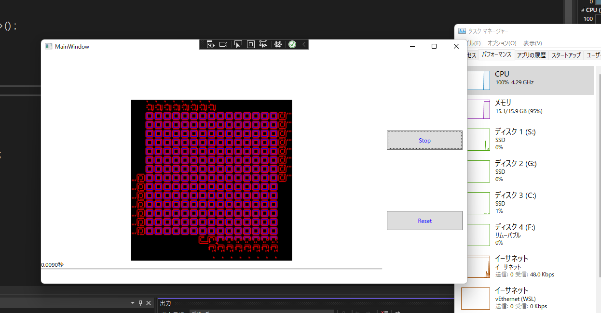

## 非同期並列プログラムの練習　

[ラングトンのループWIKi](https://sub-asate.ssl-lolipop.jp/wiki/%E3%83%A9%E3%83%B3%E3%82%B0%E3%83%88%E3%83%B3%E3%81%AE%E3%83%AB%E3%83%BC%E3%83%97)

スタートボタンで開始。
ネイティブアプリの特性を活かし許せるだけCPUのコアを食いつぶしながら幾何学模様を描画。

\multiCoreTest\LangtonsLoops\bin\Debug\LangtonsLoops.exeで実行

## 参考

* [並行処理、並列処理、同期処理・非同期処理についてまとめ Qiita](https://qiita.com/kyabetsuda/items/384a57ff6b7250de40ad)

* [非同期処理を含む終了処理はTaskをawaitせずにWait()で同期的に待たなければならないケースもあるよ Qiita](https://qiita.com/ry18847/items/eb72f575d3e2cb8443af)

* [人工生命ラングトン・ループ](http://merom686.g1.xrea.com/langton.html)